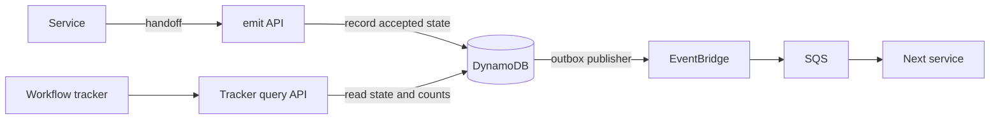

# A Workflow Tracker for the EventBridge Pipeline

*2026-09-12*

In the [EventBridge concept](document-pipeline-eventbridge.md), each document has one service responsible for its next action. A workflow tracker turns that ownership into a view people can use.

Imagine opening the tracker and seeing these illustrative numbers:

| Service | Documents assigned |
|---|---:|
| Extraction | 24 |
| Classification | 8 |
| Review | 137 |
| Finalization | 3 |

Click **Review** to see its documents, oldest assignment first. Open `invoice-42` to see “Waiting for approval, assigned at 09:20” and the handoffs that brought it there.

“Assigned” includes queued, running, and waiting work. It measures business responsibility, not worker concurrency or SQS queue depth. A review waiting on a person still belongs to review.

The schema below is one possible way to support this view with DynamoDB. The document pipeline remains an illustrative example.

## Where the tracker gets its information

The shared `emit` API verifies the sender against the current owner, then records `nextOwner` as the new owner when accepting a handoff. The tracker can read that record through a query API:



The tracker needs no calls to each processing service to assemble the current stage. Services report progress through the shared contract; the tracker displays the last accepted state. If the UI needs to distinguish queued from running work, the service must report when it starts.

Record the state change and an outgoing event intent together, then publish the intent to EventBridge. This [transactional outbox pattern](https://docs.aws.amazon.com/prescriptive-guidance/latest/cloud-design-patterns/transactional-outbox.html) covers a crash between saving the handoff and publishing its event. The recorded owner may therefore have work whose delivery is still pending.

A separate tracker could instead subscribe through EventBridge and SQS and build its own view. That adds projection delay and requires handling duplicate and out-of-order events. Reading the existing accepted state is the simpler starting point for this concept.

## Start with the questions

| Question | Read path |
|---|---|
| Where is this document now? | Read its current-state item |
| Which documents belong to review? | Query an owner index |
| Which review documents are overdue? | Query an owner-and-deadline index |
| How many documents belong to each service? | Read service counter items |
| How did this document get here? | Query its history items |

A stage is represented by `owner`; `status` describes progress within that stage. For example, review could have `waiting-for-approval` or `decision-recorded`. A completed document has a terminal status and no active owner.

## A possible DynamoDB table

Use a table called `Workflow` with string keys `PK` and `SK`. Keep one current-state item per document, history beside it, and separate count items:

| Item | PK | SK | Example attributes |
|---|---|---|---|
| Current state | `DOC#invoice-42` | `STATE` | owner, status, version, assignedAt, dueAt |
| Accepted transition | `DOC#invoice-42` | `EVENT#000007` | eventId, eventType, previousOwner, owner, acceptedAt |
| Service count | `OWNER#review` | `COUNT` | documentCount: 137 |

The current-state item might look like this:

```yaml
PK: DOC#invoice-42
SK: STATE
owner: review
status: waiting-for-approval
version: 7
assignedAt: '2026-09-12T09:20:00Z'
dueAt: '2026-09-13T09:20:00Z'
```

`version` increases for each accepted state change. History uses that version, padded to a fixed width, to preserve the accepted sequence. `assignedAt` changes when a new assignment begins; an ordinary progress update keeps it unchanged so the tracker does not reset the waiting age.

For clarity, these examples assume one workflow run per document in one scope. Multiple tenants need tenant-scoped keys and authorization. If reprocessing is supported, include run identity in state, history, and handoffs, and decide whether counts represent active runs or distinct documents.

## Indexes for service views

A global secondary index (GSI) provides another way to query the same items. Add these derived attributes to active current-state items:

| Index | Partition-key attribute and example | Sort-key attribute and example |
|---|---|---|
| `ByOwner` | `ownerPK`: `OWNER#review` | `ownerSK`: `2026-09-12T09:20:00Z#invoice-42` |
| `ByOwnerDue` | `duePK`: `OWNER#review` | `dueSK`: `2026-09-13T09:20:00Z#invoice-42` |

Use a consistent UTC timestamp format. The document suffix breaks ties. Only populate deadline keys when there is a deadline; remove both sets of index keys when a document finishes. History and count items omit these attributes, so they do not enter the indexes. This uses DynamoDB's [sparse index behavior](https://docs.aws.amazon.com/amazondynamodb/latest/developerguide/GSI.html).

Project the document identifier, owner, status, assigned time, and deadline into the indexes so a list can display them without fetching every document separately.

Conceptually, the tracker reads:

```text
Document details:  GetItem(DOC#invoice-42, STATE)
Review work:       Query ByOwner where ownerPK = OWNER#review
Overdue reviews:   Query ByOwnerDue where duePK = OWNER#review
                   and dueSK < current UTC timestamp
Document history:  Query PK = DOC#invoice-42, SK begins with EVENT#
```

The owner query returns oldest assignments first. Paginate lists as they grow. The deadline query above treats a deadline strictly before now as overdue. For all services, run that query for each known owner.

GSI reads are eventually consistent: a document can briefly appear under its previous owner after a handoff. The detail view can use a strongly consistent base-table read. Before acting on a listed document, validate its current state and version. See [DynamoDB index consistency](https://docs.aws.amazon.com/amazondynamodb/latest/developerguide/GSI.html).

## Counts without reading every document

For a small prototype, the tracker could count the owner query's results. However, `Select=COUNT` still consumes read capacity and requires pagination beyond the query page limit; it is not a constant-cost aggregate. A changing, paginated index also does not provide a single snapshot. See [DynamoDB query counts](https://docs.aws.amazon.com/amazondynamodb/latest/developerguide/Query.Other.html).

For a frequently refreshed dashboard, maintain a count per owner. When a document moves from routing to review, accept these changes in one transaction:

```text
Verify the authenticated caller matches sender.
Require the stored owner to equal sender and the version to match.
Set its owner to review and increment its version.
Decrease routing's count by one.
Increase review's count by one.
Append history and record the outgoing event intent.
Record a receipt for this handoff's stable event ID.
```

The owner and version checks are conditions on the state update inside the transaction. A wrong sender or stale version rejects the handoff without changing state, counts, or outgoing intents. Record the rejected attempt separately for troubleshooting. The version also prevents an old completion from being accepted if the document later returns to the same service. The initial upload instead requires permission to create the workflow and a condition that its state does not already exist.

Initial assignment increments only the first owner's count; completion decrements only the last owner's count. Progress within the same assignment leaves counts unchanged. Every ownership-changing path must use the same accounting.

A repeated handoff returns its existing receipt and does not change counts again. The receipt must be conditionally created in the same transaction; a preliminary lookup alone would not prevent concurrent duplicates. These are application-maintained transactional counts, following the approach described in [AWS's item-count guidance](https://aws.amazon.com/blogs/database/obtaining-item-counts-in-amazon-dynamodb/).

The tracker reads the small set of count items for its overview. A transactional read can give a consistent snapshot across those items. The counts describe accepted assignments; the GSI lists may briefly lag behind them.

## Keeping the starting point manageable

Start with document lookup, an owner list, and assignment age. Add the deadline index when the tracker needs overdue views, and stored counters when repeatedly counting lists becomes expensive.

A busy owner can concentrate index writes and counter contention. At higher volume, partition by tenant or workload, then consider sharded owner indexes and counters; the tracker must combine the resulting reads. Another option is asynchronous dashboard counts, with a visible refresh time and reconciliation process.

The tracker makes service responsibility visible. A document assigned to review for two days gives an operator a concrete place to investigate, while service counts show where work is accumulating.
